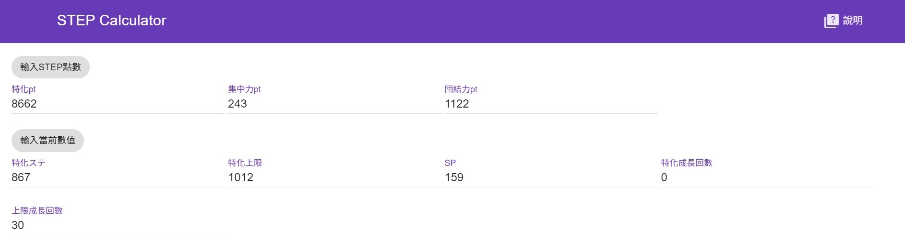
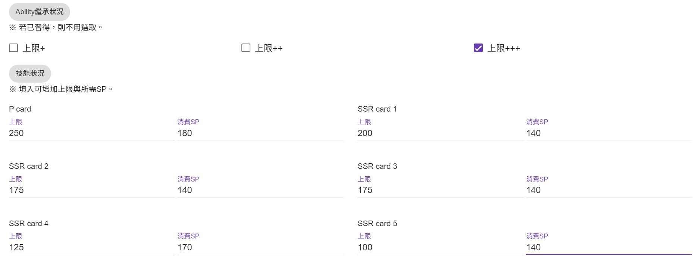
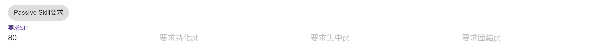
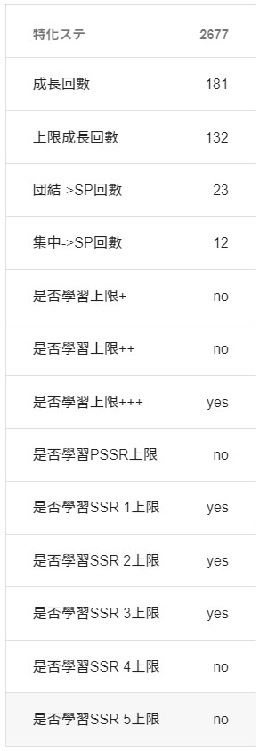

# S.T.E.P.ステ振り計算機

## 使用方法

學完該學的アビリティ之後，輸入特化點數及養成卡的上限panel狀況，按頁面底部計算。

計算機會算出特化最大值與需要的成長回數。
### step by step
1. 輸入pt
> 
2. 輸入繼承及上限パネル狀況
> 
3. 輸入パッシブ所需pt
> 
4. 計算結果
> 
## 計算方法

  
  
線性規劃

  
  最大化特化ステ，就是一個[整數線性最佳化問題](https://en.wikipedia.org/wiki/Integer_programming)。
  
  透過將數值與按成長的回數，可以計算出可能最高的特化ステ(如果表達式是對的話)。
  

[Used Solver](https://github.com/jvail/glpk.js/tree/master)

[Site Theme](https://github.com/google/material-design-lite)

[LP statement](https://www.jstor.org/stable/pdf/1905292.pdf)
